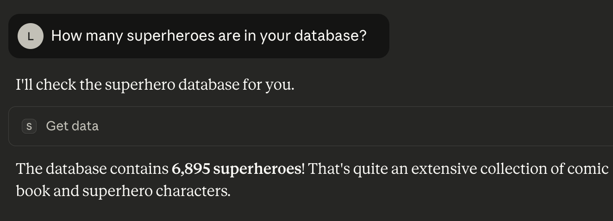

# FastMCP + Snow Leopard Example

A simple example demonstrating how to use Snow Leopard with FastMCP to create an MCP server with data retrieval capabilities.

In this example we show how to use this server with Claude Desktop, but it can be used with any system that supports the 
MCP protocol.

## Prerequisites

- [uv](https://docs.astral.sh/uv/) package manager
- [Snow Leopard Cloud API key](https://docs.snowleopard.ai/cloud/getting-started#api-keys)
- [Claude Desktop app](https://claude.ai/download)

## Setup

1. Create a [Snow Leopard Cloud](https://cloud.snowleopard.ai) instance, connect a data source, and note the instance ID from the instance's **Connection Info** tab. See the [Cloud getting started guide](https://docs.snowleopard.ai/cloud/getting-started) for details.
   - Don't have data? Load the [sample Northwind dataset](https://github.com/SnowLeopard-AI/northwind_psql) into a PostgreSQL database that Snow Leopard Cloud can reach, such as a hosted [Neon](https://neon.com) or [Supabase](https://supabase.com) database. Run the dataset's `northwind.sql` script against your database, then [add the database as a data source](https://docs.snowleopard.ai/cloud/getting-started#adding-a-data-source) in your instance.

## Usage
We will launch the MCP server using fastmcp:
```bash
uv run fastmcp run server.py
```

This will start the MCP server that can be connected to by any MCP client (like Claude Desktop, clai, etc).

### Example with Claude Desktop

Add to your Claude Desktop configuration:

Note! You need to update the `/path/to/snowy-examples/fastmcp`, `SNOWLEOPARD_API_KEY`, and `SNOWLEOPARD_INSTANCE_ID`

```json
{
  "mcpServers": {
    "snowy": {
      "command": "uv",
      "args": [
        "--directory",
        "/path/to/snowy-examples/quickstart/fastmcp",
        "run",
        "fastmcp",
        "run",
        "server.py"
      ],
      "env": {
        "SNOWLEOPARD_API_KEY": "your-api-key",
        "SNOWLEOPARD_INSTANCE_ID": "your-instance-id"
      }
    }
  }
}
```

Now you can ask Claude questions about Northwind data and it will use the Snow Leopard tool to retrieve information!


